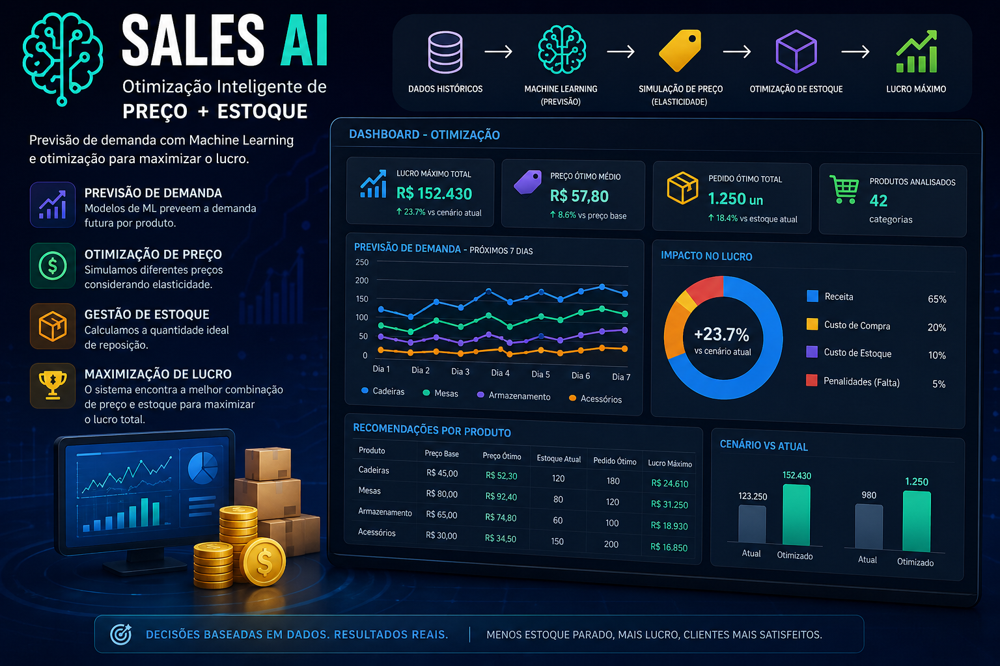

# 🚀 AI Revenue Optimization Engine

Sistema de Inteligência Artificial para previsão de demanda e otimização de preço e estoque com foco em maximização de lucro.

---

## 🧠 Problema

Empresas frequentemente enfrentam dificuldades como:

- Incerteza na demanda
- Precificação ineficiente
- Excesso ou falta de estoque
- Decisões baseadas em tentativa e erro

Esses fatores impactam diretamente o lucro e a eficiência operacional.

---

## 💡 Solução

Este projeto implementa um sistema de decisão baseado em IA que:

- Prevê a demanda futura por produto
- Simula diferentes cenários de preço
- Calcula a quantidade ideal de reposição
- Maximiza o lucro considerando custos e perdas

---

## ⚙️ Funcionalidades

- 📈 Previsão de demanda com Machine Learning
- 💰 Otimização de preço (elasticidade)
- 📦 Otimização de estoque
- 📊 Simulação de cenários
- 🎯 Maximização de lucro

---

## 🖥️ Dashboard



---

## 🛠️ Tecnologias

- Python
- Pandas
- NumPy
- Scikit-learn
- Streamlit
- Plotly

---

## ▶️ Como executar

```bash
1. Clone o repositório

git clone https://github.com/seu-usuario/sales-ai-optimization.git
cd sales-ai-optimization

2. Crie ambiente virtual

python -m venv venv
source venv/bin/activate  # Linux/Mac
venv\Scripts\activate     # Windows

3. Instale dependências

pip install -r requirements.txt

4. Execute o app

streamlit run app.py
